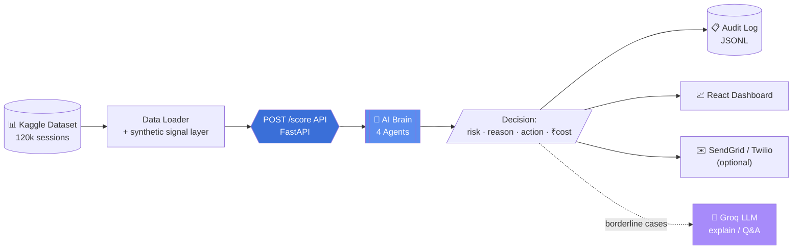
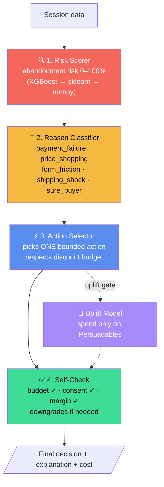
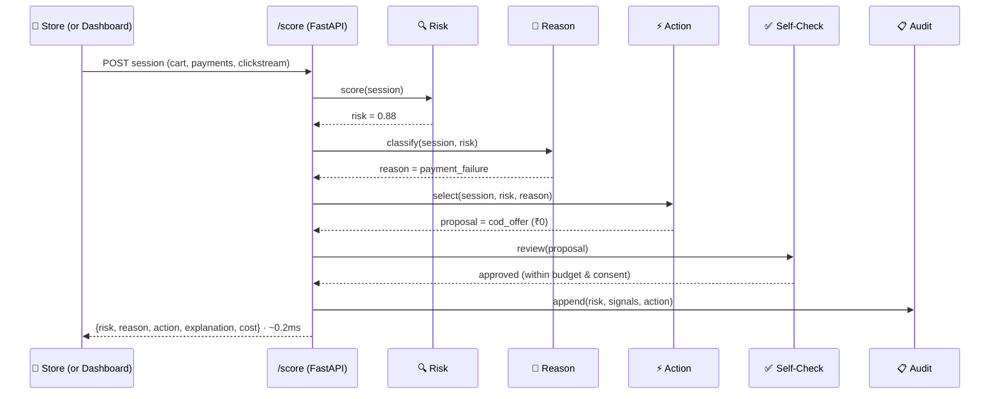

# 🛒 Cart Rescue — Abandonment Diagnosis & Remediation Agent

> **Stop blasting coupons at everyone.** Cart Rescue is a real-time, multi-agent AI that scores each shopping session's abandonment risk, diagnoses *why* the shopper might leave, and picks the *one* smartest action — including doing nothing — all within a strict discount budget.

<p>
  
  
  
  
  
</p>

**AI BUILD 2026 · E-Commerce in India · Student Edition · Track 2 (Cart Rescue)**
Category: *Growth, Conversion & Payments*

---

## 🎯 The Problem

Indian shoppers abandon carts for very different reasons — a surprise shipping cost, a **failed UPI/netbanking payment**, a disappointing delivery date, price-checking another app, no COD option, or plain friction in the form. Most sites respond the **same way regardless**: blast a discount coupon. That **erodes margin** on people who would have bought anyway, and does **nothing** for someone whose payment simply failed.

## 💡 Our Solution

A **plug-and-play decision service** (`POST /score`) powered by **four cooperating AI agents**. For every session it returns — in under a millisecond — a risk score, the reason, one bounded action, a plain-English explanation, and the decision cost. A live React dashboard streams the decisions and proves the money impact with a real A/B holdout.

---

## 📊 Project Status

| Phase | Feature | Status |
|-------|---------|:------:|
| **1** | Data loader (dataset-agnostic) + 4-agent pipeline + audit log | ✅ Done |
| **1** | `POST /score` FastAPI service | ✅ Done |
| **2** | A/B holdout + true uplift measurement | ✅ Done |
| **2** | **Uplift modeling** (Persuadables targeting) | ✅ Done |
| **2** | Cost-per-decision routing (cheap ML vs LLM) | ✅ Done |
| **2** | Self-Check agent (budget + consent + margin) | ✅ Done |
| **3** | React live dashboard + AI reasoning + explainability chat | ✅ Done |
| **3** | India-specific logic (UPI failure, COD, festival mode) | ✅ Done |
| **3** | Groq LLM explainability (with safe fallback) | ✅ Done |
| **4** | Docs, diagrams, pitch, demo script, Q&A | ✅ Done |
| **3** | **SendGrid email + Twilio SMS/WhatsApp — real sending** | ✅ Done |

---

## 🏗️ System Architecture



## 🔄 AI Workflow — the 4 cooperating agents



## ⏱️ One session through `/score` (sequence)



---

## ✨ Features

- **4 cooperating agents**, not one mega-prompt — each transparent and auditable.
- **"Do nothing" is a first-class action** — we protect margin on sure buyers.
- **India-specific remediation**: detects UPI-failure patterns → offers **Cash-on-Delivery**; **festival mode** shrinks coupons when demand is high; respects **TRAI/DND & WhatsApp opt-in**.
- **Uplift modeling** (T-learner): spend budget **only on Persuadables**, never on sure-things, lost-causes, or sleeping-dogs.
- **Cost-per-decision routing**: ~90% of decisions use a cheap classical model; only genuinely uncertain cases escalate to an LLM.
- **Proven with a real A/B holdout** — true uplift, not correlation.
- **Real recovery nudges**: actually sends email (SendGrid) and SMS/WhatsApp (Twilio), with consent enforced; safe dry-run without keys.
- **Explainable AI**: every action ships with a plain-English "why", plus a Groq-powered Q&A chat.
- **Hybrid ML**: uses XGBoost/scikit-learn if installed, else a pure-numpy fallback — **always runs**.

## 🧰 Tech Stack

| Layer | Tech |
|-------|------|
| AI Brain / API | Python · FastAPI · Pydantic |
| ML | scikit-learn / XGBoost (optional) · pure-numpy fallback |
| Uplift | T-learner (two-model) |
| LLM (explainability) | Groq — `llama-3.1-8b-instant` (free tier) |
| Dashboard | React 18 · Vite · Tailwind CSS · Recharts |
| Data | Kaggle e-commerce clickstream/transaction datasets |
| Notifications (optional) | SendGrid (email) · Twilio (SMS/WhatsApp) |

## 📁 Folder Structure

```
cart_rescue/
├── backend/
│   ├── api.py                 # FastAPI: /score, /explain, /ask, /llm_status
│   ├── core/
│   │   ├── config.py          # all business economics in one place
│   │   ├── schema.py          # SessionFeatures (dataset-agnostic contract)
│   │   ├── data_loader.py     # loads dataset1/2/4 + synthetic signal layer
│   │   ├── orchestrator.py    # chains the 4 agents + audit + cost routing
│   │   ├── evaluation.py      # A/B holdout + uplift + money math
│   │   └── llm_explainer.py   # Groq LLM (safe template fallback)
│   └── agents/
│       ├── risk_scorer.py     # Agent 1
│       ├── reason_classifier.py  # Agent 2
│       ├── action_selector.py    # Agent 3
│       ├── self_check.py         # Agent 4
│       └── uplift_model.py       # Persuadables (T-learner)
├── dashboard/                 # React + Vite + Tailwind live dashboard
│   └── src/ (App.jsx, components/, api.js, demoData.js)
├── scripts/ (train.py, run_demo.py)
├── docs/  (DEMO_SCRIPT.md, PITCH.md, QA_PREP.md)
├── requirements.txt · .env · LICENSE · CONTRIBUTING.md
└── dataset1..4/               # your Kaggle data (git-ignored)
```

---

## 🚀 Setup & Run

### Prerequisites
- Python 3.9+ and Node.js 18+
- The Kaggle datasets extracted into `dataset1/ … dataset4/` (dataset2 is the primary)

### 1. Backend (the AI brain)
```bash
cd cart_rescue
pip install -r requirements.txt

# (optional) enable the live Groq AI chat — free key at https://console.groq.com/keys
# edit .env  ->  GROQ_API_KEY=gsk_xxx

# train the risk model (writes models/risk_model.pkl)
python -m scripts.train

# run the full demo: data → score → A/B → money math (prints metrics)
python -m scripts.run_demo

# start the API
uvicorn backend.api:app --reload --port 8000
#  → http://localhost:8000/docs  (interactive Swagger)
```

### 2. Dashboard (the frontend)
```bash
cd dashboard
npm install
npm run dev
#  → http://localhost:5173
```

> The dashboard runs **standalone** (built-in session simulator), so it works even if the backend is down — reliable for a live demo. With the backend up, the "Ask the AI" panel calls the real Groq-backed endpoint.

### Environment variables (`.env`)
| Key | Purpose | Required? |
|-----|---------|:---------:|
| `GROQ_API_KEY` | Live LLM explanations + Q&A | Optional |
| `SENDGRID_API_KEY` | Real recovery emails | Optional |
| `TWILIO_ACCOUNT_SID` / `TWILIO_AUTH_TOKEN` | Real SMS/WhatsApp | Optional |

---

## 📈 Results / Impact

> Measured on **81,518** intent sessions (dataset2) with a 30% A/B control holdout.

| Metric | Result |
|--------|--------|
| 🎯 Risk model AUC (honest, leakage-free) | **0.82** |
| 📈 Treatment recovery vs control | **36.3% vs 10.5%** |
| 🚀 **True A/B uplift** | **+25.7 percentage points** |
| 💰 Net incremental margin (demo scale) | **₹47.4 L** |
| 🎟️ Discount per recovered cart | **₹4.8** |
| 💸 Discount saved vs "coupon-to-everyone" | **99% less** |
| ⚡ Avg cost per decision | **₹0.025** (~10× cheaper than LLM-for-all) |
| 🧮 Decisions on cheap ML vs LLM | **90% / 10%** |
| ⏱️ Avg decision latency | **0.19 ms** |
| 📐 Persuadables identified (budget target) | **~10%** of sessions |

> 📷 *Dashboard screenshot: add `docs/dashboard.png` after running `npm run dev`.*

---

## 🔌 API Reference — `POST /score`

**Request**
```json
{
  "session_id": "sess_04821",
  "n_page_view": 6, "n_add_to_cart": 1, "n_checkout": 1,
  "duration_s": 120, "cart_value": 2450, "cart_size": 2,
  "n_payment_attempts": 3, "payment_failed": true,
  "device": "mobile", "country": "IN",
  "consent_email": true, "consent_whatsapp": false,
  "reached_intent": 1
}
```

**Response**
```json
{
  "session_id": "sess_04821",
  "risk": 0.88,
  "reason": "payment_failure",
  "reason_confidence": 0.82,
  "action": "cod_offer",
  "discount_amount": 0.0,
  "channel_cost": 0.0,
  "explanation": "3 failed UPI attempts — the payment rail is the blocker, so offer Cash-on-Delivery to bypass it.",
  "top_signals": [{"signal": "payment failed after attempt(s)", "weight": 0.9}],
  "decision_cost": 0.25,
  "engine": "llm_escalated",
  "latency_ms": 0.21
}
```

Other endpoints: `POST /explain` (rich narrative), `POST /ask` (judge Q&A), `GET /health`, `GET /llm_status`.

---

## 🗺️ Roadmap / What's Next
- Online **learning loop**: feed realized outcomes back to retrain nightly.
- ✅ Real **SendGrid/Twilio** sending is built — add keys to `.env` to send live (safe dry-run without keys).
- **Contextual bandit** to auto-tune per-reason action efficacy from live data.
- Per-store **budget optimizer** across concurrent campaigns.

## 🔬 A Note on Data Honesty
We analysed all four datasets. dataset2's cart value & payment fields are only logged **at purchase time** (they leak the outcome), and its raw pre-decision browsing is non-predictive. As the problem statement anticipates, we keep dataset2's **real funnel structure** and overlay a **clearly-labelled synthetic behavioural layer** (UPI failures, price-shoppers, friction) — every synthetic field is tagged in the audit log. This yields an honest AUC of 0.82 (not a suspicious 1.0).

## 👥 Team / Credits
- **Pavan Teja Kanithi** — [GitHub](https://github.com/Pavanteja-0823) · [LinkedIn](https://www.linkedin.com/in/pavanteja-kanithi/)
- Built for **AI BUILD 2026**, Track 2 (Cart Rescue).

## 📄 License
MIT — see [LICENSE](LICENSE).
